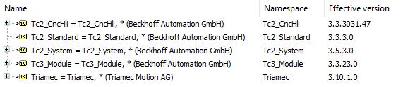

# TwinCAT Example using CNC and Tria-Link

This TwinCAT 3 application example helps you getting started to use a *Triamec* drive with *Tria-Link* fieldbus.

> [!NOTE]
> The example code makes use of the *Beckhoff* library *Tc2_CncHli*. Add it to the project.
> Example tested with TwinCAT *v3.1.4024.50* and following libraries:

